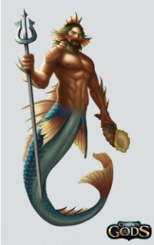
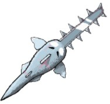

# CaptainBrineTooth
This repository is made for the development of the videoGame Captain BrineTooth.

**Documento de diseño de videojuego**

_David Brey Plaza, Adrià Carreras Bagur, Miguel Hernández García, Ángel López Benítez, Óscar Maya Jiménez, Juan Diego Mendoza Reyes, Iván Prado Echegaray, José Daniel Rave Robayo, Daniel Ruiz Figueroa_

| **Resumen** |
| --- |
| **Géneros:** RogueLike, Acción |
| **Modos:** Aventura |
| **Público objetivo:** … _Edad, sexo, región e idioma_ |
| **Plataformas:** PC |
| **Cantidades:** Escenarios = 3 Armas = 10-11 Personajes = 2 (Pescador y Fishtler) Enemigos = 6 Boss = 1 |
| **Hitos:** 24 Febrero [HITO 0] - 17 Marzo [HITO 1] - 28 Abril [HITO 2] - 19 Mayo [ENTREGA] |

**Descripción**

Captain BrineTooth es un videojuego surgido como proyecto para la asignatura Proyectos 2 en la Universidad Complutense de Madrid. Los desarrolladores iniciales son estudiantes aún novatos en la realización de videojuegos con C + +.

La gestión de este proyecto se realizará en Pivotal Tracker: (Insertar enlace al Pivotal)

El control de versiones se realizará utilizando GitHub: (Insertar enlace a GitHub)

Captain BrineTooth no tiene antecedentes o predecesores.

El juego será producido utilizando Visual Studio y la librería SDL.

| **Logotipo y portada del juego** |
| --- |
|  |

**Documento**

1. **Aspectos generales**

Captain BrineTooth es un juego roguelike en el que se pretende transmitir al jugador una sensación de frenetismo y rapidez.

Nuestro jugador controlará a un pescador gallego, quien ha naufragado en una isla aparentemente desierta, pero luego descubre que no está solo. Debido a varios residuos tóxicos de la 2º guerra mundial, varios peces han mutado volviéndose agresivos. Entonces, buscando una forma de salir de ahí, busca al enemigo más fuerte para derrotarlo y escapar

La principal mecánica innovadora del juego es la mecánica de pesca, en la que el jugador utiliza su caña para intentar obtener un arma o mejora en un minijuego. El arma o mejora obtenida depende de la suerte del jugador y de su habilidad. Esto añade una cierta aleatoriedad a la partida que provoca que cada partida sea diferente.

Independientemente del arma que consiga, el jugador tendrá que intentar avanzar por el nivel derrotando enemigos de la forma más eficiente posible.

  1.1. **Relato breve y parcial de una partida típica**

El jugador comienza en una zona inicial donde podrá obtener su primera arma mediante un minijuego de pesca explicado más adelante. A partir de ahí se dará paso a un dungeon con habitaciones generadas de manera aleatoria. La mayoría de estas habitaciones son salas con enemigos que el jugador debe de derrotar. El jugador también se podrá encontrar con una sala especial en la que se encontrará de nuevo el minijuego de pesca inicial, pero esta vez conteniendo tanto armas como mejoras. Dependiendo de su habilidad y suerte el jugador deberá de intentar conseguir el objeto que más le convenga de este minijuego.

En una de las salas el jugador se encontrará con un jefe final que deberá de derrotar para pasar al siguiente piso del dungeon. Cada vez que el jugador pasa de piso se encontrará de nuevo con el minijuego de pesca pero mantendrá sus objetos y mejoras del piso anterior.

2. **Menús y modos de juego**

En el menú de pausa habrá un glosario que permitirá al jugador revisar ciertos aspectos del juego con los que ya se ha encontrado. Esto incluye: mejoras, objetos, monstruos, etc.

  2.1. **Configuración**

Menú de opciones: Podrás subir o bajar el volumen del juego, ver los créditos del juego y los contactos de los desarrolladores del juego.

Glosario el Monstruoso DIARIO de Monstruos Marinos: Se podrá ver un glosario el cual explica el origen de todos los enemigos, las armas y sus caracteristicas, las mejoras y sus efectos, el arbol de habilidades con cada habilidad explicada

  2.2. **Interfaz y control**

3. **Jugabilidad**

Aquí describiremos los distintos apartados que afectan a la jugabilidad del juego:

  3.1. **Mecánica**

MECÁNICA DE PESCAR

El jugador tiene una cantidad limitada de cebos para pescar. Cada vez que lo intenta, inicia un minijuego (Cambiamos de pantalla) en el que el jugador maneja el gancho de la caña intentando pescar el mejor recurso posible (Peces, Algas, Corales)

La caña irá bajando automáticamente y el jugador podrá moverse lateralmente, esquivando obstáculos. Habrá 3 capas de profundidad y cuanto más profundo llegue el jugador, mayor la calidad del recursos que consiga.

El jugador podrá salir del modo de pesca en cualquier momento, siempre que le de al boton ESC

Ej Gráfico:

MOVIMIENTO

El jugador puede moverse lateralmente y saltar. Para moverse con más facilidad, podrá hacer un dash (que se ve como un slide). Además podrá equiparse con armas y atacar con ellas.

SISTEMA DE COMBATE

El jugador podrá tener a su disposición 2 armas como máximo, empezando con un arma aleatoria de estas [Pez Espada, Pez Martillo...] (Solo 1 al principio). El jugador podrá alternar entre ambas armas, pero nunca usar las 2 a la vez.

ECONOMÍA

El jugador puede conseguir monedas en una sala especial (cofre del tesoro), con las cuales podrá comprar armas y desbloquearlas para ese &quot;intento&quot;. Cada cofre suelta 500 Monedas

- Ratio de aparición
  - 1º nivel = 1 cofre
  - 2º nivel = 2 cofres
  - 3º nivel = 3 cofres

  3.2. **Dinámica**

El videojuego se presenta en una vista lateral con el jugador al mando del Capitán Brinetooth. En su aventura encontrará una gran variedad de armas que le ayudarán a derrotar las hordas de Fishler.

Comenzará con un arma aleatoria y a lo largo de la partida podrá llevar hasta 2, pudiendo cambiar entre ambas. El jugador tendrá que abrirse camino a través de varias habitaciones. Al despejar una de ellas, el jugador podrá avanzar a la siguiente que se escogerá de manera aleatoria, haciendo que cada intento sea único. El Capitán debe superar tres zonas temáticas en función de la profundidad relativa a la que se encuentra el jugador.

El Capitán podrá toparse con &#39;habitaciones del tesoro&#39; donde tendrá que superar un reto en forma de oleada de enemigos. Al completarlo el capitán obtendrá cinco monedas.

Para completar una partida, el jugador deberá derrotar a Fishler. Si el Capitán es derrotado y muere, vuelve al lobby y donde podrá desbloquear nuevas armas así como comenzar un nuevo intento de derrotar a Fishler.

  3.3. **Estética**

Estética de Pixel Art.Siguiendo un estilo vintage - nautical.

4. **Contenido**

Ahora pasamos a describir todo el contenido jugable del juego:

  4.1. **Historia**

Pescador gallego en la segunda guerra mundial. Naufragas en una isla la cual está contaminada por antiguos residuos tóxicos alemanes de la 2º guerra mundial. Los peces se empiezan a convertir en peces nazis y para salir de la isla tienes que llegar hasta Fishtler que es muy malo dependiendo de tu punto de vista respecto a la sociedad y la política y para nuestro pescador eso está mal.

[Idea para primer enemigo: un pez o algo que ves como se mete en un charco verde y se vuelve humanoide, se pone de pie y coge del suelo un sombrero nazi o algo y se rie o lo que sea].

  4.2. **Lobby**

En el lobby se podra comprar armas, desbloquear ciertas habilidades del arbol de anzuelos y la siguiente habitacion despues del lobby sera la zona de pescar.

- En la primera zona, señalizar DE FORMA EXAGERADA que tiene que pescar

  4.3. **Niveles**

El mapa estará conformado por varios bloques separados (en archivos de texto como en el PacMan de TPV), y se encarga de generar un mapa randomizado, uniendo dichos bloques.

Ej Gráfico:

Habrá 3 niveles diferentes, tal que tendrán como principales diferencias:

- La estética de los escenarios
- Ciertos enemigos, y los tipos de sala que se generan.
- Tipos de trampas
- Nº de habitaciones

El número de habitaciones de cada nivel se repartirán tal que:
- 1º nivel = 12 habitaciones
- 2º nivel = 10 habitaciones
- 3º nivel = 8 habitaciones
- Las habitaciones del cofre del tesoro y de pescar no cuentan en el número total de habitaciones

Las trampas que habrá serán:

- Trampas con restos de barco (la tipica trampa de pinchos)
- Placas de presion + Ancla (Al posicionarse encima de una placa de presion, suelta un ancla de cierta habitacion [la cual puede hacer insta kill a cualquier enemigo])

El jugador podrá moverse por todo el escenario en todo momento, independientemente de los enemigos que haya.

Las habitaciones se generan todas al inicio del nivel y se destruyen al pasar de nivel. Estos se generarán como mapa de TILED.

ROOMS ESPECIALES

- Cofre del tesoro
- Zonas de Pesca

  4.4. **Música y banda sonora**

- Drunken Sailor
- ...

  4.5. **Personajes**
  En este apartado describimos los personajes que van apareciendo en el juego:
    4.5.1. **Protagonista (Pescador)**

Pescador: Buen hombre, gallego calvo, rechoncho y con barba, que tiene como hobby pescar y hacer armas. Por eso ha decidido pescar los peces mas extraños y agresivos para formar las armas más mortíferas posibles

**IMAGEN**

**Vidas**

El jugador tendrá unos 10 anzuelos / vidas de forma inicial, cada ataque que reciba le quitará medio anzuelo.

    1. **Enemigos**

_ **Datos útiles sobre los enemigos** _

- Ceguera u ojos a menudo no funcionales dada la falta de luz.
- Bocas y dientes gigantes, muchas veces más grandes que sus propios cuerpos.
- Estómagos dilatables, capaces de ingerir presas más grandes que ellos mismos

**Fanfin Anglers → ThornFish**

- Tamaño pequeño pero boca gigante con dientes afilados y aterradores.
- Este ser de aspecto de globo está provisto de órganos sensibles en forma de espinas que le sirven para detectar los movimientos de las presas.
- Asimismo, su antena le sirve para atraer y pescar a sus presas
- Una moneda sustituye a la luz y cuando vas a cogerla te ataca
- Vida = 200

**IMAGEN**

**Mitsukurina owstoni → ElfShark**

- Esta especie puede llegar a medir entre dos y tres metros, sin embargo, destaca por su mandíbula, repleta de dientes muy afilados, así como la prolongación que sobresale de su cara.

- Lo más característico de este ser es su capacidad deproyectar su mandíbula hacia delante cuando abre la boca. **(ATAQUE DE ÁREA).**
- Cuando se carga se empieza a ver la boca roja ataque de área en una determinada distancia.
- Vida = 300-350

**IMAGEN**

**GusanoPompeya → PompeyWorm**

- Posee tentáculos sobre la cabeza y tiene una apariencia peluda. Vive adherido a las paredes de los respiraderos hidrotermales volcánicos en fosas oceánicas.
- Sus pelos atacan el área porque realiza una carga y envenena el suelo con el que entra en contacto.
- Vida = 500

**IMAGEN**

**Medusa del Sombrero de flores → FlowerJellyHat**

- Estas medusas comen peces pequeños y pueden crecer o reducir su tamaño en función de la proximidad del enemigo.
- A su contacto te quedas paralizado un breve tiempo.
- Ataque de la medusa: Uso de su cuerpo.
- Vida = 150

**IMAGEN**

**Fringehead**

- Ataca disparando proyectiles que son plankton.
- Si le disparas con la boca abierta le haces el doble de daño.
- Vida = 800
- Dañarlo con la boca abierta supone un +100 de daño

**IMAGEN**

**Tritón**

- Ataques a melee.
- Suponemos que tiene una vida media y un daño medio , no es el enemigo que más daño hace.
- Si el jugador entra en el rango de detección del tritón, detecta en qué lado se encuentra el jugador, y realiza una coreografía/combo de ataques predeterminados.
- Vida = 1000

**IMAGEN**

**FISHLER**
- Fishler tendrá 2 fases. Al perder la mitad de su vida, liberara un pedo de tinta a modo de rugido(?) y cambiará de fase

- Movimiento
  - **[1º FASE]** Camina X pasos de forma normal hacia el jugador
  - **[2º FASE]** Salta de forma impredecible (De una forma parecida al movimiento de la medusa)
  - Placaje (Corre directamente hacia el jugador a modo de placaje)
- Ataque sorpresa (El ataque es parecido al de ElfShark)
  - Visualmente, se podrá ver a Fishler acariciar una MORENA / Pez Vibora. Si el jugador se acerca mucho, le muerde a modo de perro rabioso
  - Si falla el ataque entonces usará un ataque a distancia random de estos 2
    - Dispara de lejos com el FringeHead 
    - **IMAGEN**
    - 

    - **[2º FASE]** Lanza puas con cierto ángulo como el Pompey Worm
    - Visualmente, se verá como Fishler usa unas serpetinas que dispara erizos de mar
    - 

- VIDA = 5000-4000
- **CONCEPT ART DE FISHLER**

  4.6. **Items**

**CANTIMPLORA**

Item que restaura X anzuelos de vida. El jugador empezará con 2 usos como máximo de su cantimplora, la cual cada uso le recupera 2.5 de vida. El limite de usos se pueden aplicar con cierta habilidad del árbol de anzuelos.

**TIERS**

- S: pez sierra, whalesome(DLC de lanzamiento)
- A: anguila electrica, BBgloves, ametralladora anchoas
- B: Escupetintas, escudo, tiburon martillo, pez globo
- C: pez espada, shuriken

- TODOS LOS DAÑOS DE LAS ARMAS TIENEN YA APLICADO EL X2 DEL DAÑO

**MINIMAPA/BRÚJULA**
El jugador podrá ver durante todo momento de la partida, el minimapa (Situada arriba a la derecha de la pantalla). Si no ha explorado X sala o esa sala no tiene nada en especial, aparecerá en blanco. Pero si es una zona de pescar o una habitacion del cofre del tesoro, entonces aparecera marcado

**Armas CUERPO A CUERPO**

| Puños | Pega bofetadas a los enemigos | Coger la animacion cuando el pescador lanza el pez globo solo que sin los peces | DAÑO = 30 x segundo(30 x golpe) | PRECIO = Nulo |
| --- | --- | --- | --- | --- |
| Pez Espada | Ataca con estocadas |  | DAÑO = 75 x segundo (50 x golpe) | PRECIO = 500 monedas(1 salas cofre) |
| Tiburón Martillo | Ataca con un swing lateral, mandando hacia atrás al enemigo ( **KnockBack** ) |  | DAÑO = 150 x golpe(100 x segundo) | PRECIO = 1000 monedas(2 salas cofre) |
| Pez Sierra | Estilo de combate: 2 swings, 3 giros y luego apuñala con la motosierra. Matar a un enemigo supone un buff de ataque y velocidad. Se puede acumular buffs hasta un límite. Después de X tiempo, se devuelve los stats del jugador a la normalidad (Meter musica Heavy Metal o otro tipo de música mientras se tienen los buffs?) |  | DAÑO: Swings = 125 x golpe(250 x segundo); Giros = 150 x giro(225 x segundo); Apuñalamiento = 200 x golpe (200 x segundo) | PRECIO =2500 monedas (5 salas cofre) |
| Escudo Crustáceo | Atacas empujando con el escudo. (Lanzar y que rebote?? [Referencia al Capitán Capitalismo/ América]) |  | DAÑOEmpujon = 100 x golpe(100 x segundo); Lanzamiento = 100 x golpe (100 x segundo) | PRECIO =1000 monedas(3 salas cofres) |
| CraBBoxing Gloves | Atacas a guantazo limpio contra todo el mundo. También puedes agarrar al enemigo y lanzarlo | Guantes de boxeo con forma de pinza de cangrejo | DAÑO50 x golpe (175 x segundo) | PRECIO = 1500 monedas(4 salas cofres) |

**Armas a DISTANCIA**

| Ametralladora de anchoas | Dispara balas con mucha cadencia | Pez que escupe anchoas | DAÑO = 15-20 x golpe(140 x segundo) | PRECIO = 1500 monedas(4 salas cofres) |
| --- | --- | --- | --- | --- |
| Anguila eléctrica | Pega latigazos y si golpea a un enemigo, lo **electrifica**. Puede golpear a varios enemigos | Un palo con la cola de una anguila eléctrica atada | DAÑO = 150 x golpe (+150 efecto electrico); (230 [golpe normal] x segundo) | PRECIO = 1500 monedas(4 salas cofres) |
| Bombas Pez Globo | Lanza bombas que explotan y salen disparadas varias espinas. (Usar como ejemplo el ataque basico de Spike de Brawl Stars?) | Peces Globo con un mechero en la boca (??) | DAÑO Explosion = 100 x golpeEspinas = 20 x espina | PRECIO = 1000 monedas(2 salas cofre) |
| Escupe-Tintas | Ataca con una nube oscura de tinta que envenena y ralentiza. (Una nube hace 3 golpes antes de desaparecer) | Un fuelle de aire con forma de calamar / pulpo?? ! | DAÑO: 50 x golpe+10 veneno (175+10 veneno x segundo) | PRECIO = 500 monedas(1 salas cofre) |
| _Shuriken Estrellado_ | Se lanza un shuriken con forma de estrella que atraviesa enemigos | _Estrellas de mar con una cinta ninja??_ | _DAÑO_50 x golpe(75 x segundo) | PRECIO = 500 monedas(1 salas cofre) |
| WhaleSome | _Dispara ondas ultrasónicas que hacen daño y noquean hacia atrás a los enemigos. Reduce la velocidad del jugador al cargar con una ballena mórbida_ | **OPCIONAL** | **DAÑO** 150 x golpe(300 x segundo) | PRECIO =2500 monedas (5 salas cofre) |

**TIPOS DE EFECTOS**

| Electrificar | Si un enemigo está electrificado, se le añade + 150 de daño al siguiente golpe que reciba y se le quita el efecto eléctrico (Por poner un ejemplo) | **Como se ve visualmente en el juego** |
| --- | --- | --- |
| Ralentizar | Reduce la velocidad de movimiento | --- |
| Sal | El veneno de toda la vida. Hace 10 de daño x segundo | --- |
| KnockBack | Hace retroceder al que reciba el golpe | --- |

  4.7. **Árbol de Anzuelos**

Habrá un árbol de habilidades las cuales se podrán desbloquear de 2 formas:

- Realizando cierta acción (Matar a cierto enemigo, realizar X cantidad de bajas con Y arma...)
- Pagando cierta cantidad (Solo se pueden comprar únicamente en el lobby [Lo cual significa que el dinero no se pierde al morir])

Habrá 4 ramas principales

- Rama del boss (Desbloqueable únicamente con logros)
- Rama de utilidad
- Rama defensiva
- Rama ofensiva

Algunas de las habilidades son:

- Dash: un corto dash horizontal hacia donde esté mirando el jugador. ¿El jugador es inmune a todo tipo de daño mientras lo hace?
- Doble salto
- Escudo: un escudo que anula un golpe. Cuando para un ataque se desactiva durante 30 segundos.
- Counter: si el jugador pulsa una tecla y recibe un golpe durante un cierto periodo de tiempo pequeño, bloquea el ataque (anulando el daño) y le hace un daño fijo de **XXXXXXXXXXXXXXX**
  - El pescador esconde las armas, bloquea el ataque con el brazo, y pega una patada al enemigo
  - El pescador esconde las armas, bloquea el ataque con un salmón random y pega un BITCH SLAP (con la mano o con un salmon)
- Infección de anémonas: Matar a un enemigo, recupera 0.1 de un anzuelo (Solo se suma al total cuando llega al 0.5, lo que significa que tiene que matar 5 enemigos para que se aplique)
- Special Counter: Si el counter tiene éxito entonces se aplica uno de estos efectos además del counter:
  - Si el enemigo está en un rango cercano, entonces el efecto es **KNOCKBACK**
  - Si el enemigo está lejos, entonces su velocidad de ataque se **RALENTIZA**
- Dientes de piraña: se aplica sólo al daño base, no a los efectos (veneno, electrificar, malla de espinas, etc)
- Armas en salmuera (Aumenta la rapidez con la que ataca)
- Golpe de Arpón: 20% de realizar un crítico (crítico = +25% daño total)
- Kit de anzuelos: el jugador consigue 2 anzuelos extras de vida (Equivalente a 4 golpes)
- Agua potable: aumenta el número de usos de la cantimplora y se podrá usar un total de 3 veces.
- Escamas de Arapaima: si el jugador recibe daño, el enemigo recibe 100 de daño.

5. **Progresión del juego**
Aquí describimos nuestras estimaciones en cuanto a la dificultad de la partida y distribuimos enemigos y trampas de forma acorde:
  5.1. **Progresión de los niveles**
- 1º nivel
  - Medusa
  - ElfShark
  - Trampas de pinchos
  - El objetivo de este nivel es enseñar a moverse al jugador y a atacar, tanto a melee (vs medusa) como a distancia (vs ElfShark). Con ElfShark, tambien aprendera el jugador a tener cuidado con los rangos de los enemigos y a tomar medidas contra ellos (Atacar de lejos o a melee y esquivando). Con las trampas aprendera a calcular los saltos y a controlar su movimiento

- 2º nivel (Sumar anteriores enemigos y trampas)
  - + ThornFish
  - + FringeHead
  - + Suelo inestable
  - + Placa Presion Ancla
  - Con ThornFish y el suelo inestable, el jugador tendra que aprender a tener en cuenta los elementos del escenario. Ademas, aprendera que las placas depresion puede ayudarle a alcanzar otras zonas o incluso a derrotar a enemigos con el ancla que cae
  - Con FringeHead, el jugador tendra que adaptarse a enemigos con un rango mucho mayor (obligandolo a aprender a esquivar si o si o a cubrirse)
- 3º Nivel (Sumar anteriores enemigos y trampas)
  - + Triton
  - + Pompey Worm
  - + Piscina de Pirañas
  - Ahora se busca joder al jugador. El jugador tendra su movilidad reducida por los Pompey Worm y su veneno que se queda tambien en las paredes/suelo. Los tritones le joderan con su patron de ataques impredecible y dificiles de matar. La piscina de pirañas, le obligara a no estar quieto en un mismo sitio porque sino recibira daño

  5.2.Estimación dificultad del juego
_OJO, muchas estimaciones pueden variar dependiendo de el rango, rapidez y cadencia de algunos ataques recibidos y enemigos_

- 1º PARTIDA (0 conocimiento de enemigos, 0 dinero, 0 manejo controles, llega al principio de la capa amarilla de pesca)
  - 1º Nivel (1-3 enemigos x nivel )

    - Medusa = 1-2 golpes
    - ElfShark = 2-4 golpes
    - +1-2 Golpes x habitacion con trampas
    - TOTAL = 3.5 golpes x enemigo x habitacion
  - 2º Nivel
    - Lo mas probable es que no llegue, o se quede a principios de nivel
  - 3º Nivel
    - No llega ni Jesucristo armado con agua bendita purificando a estos sucios nazis
- Varias Partidas (Conocimiento de enemigos de 1º nivel y parcial del segundo nivel, Ahorros suficientes como para comprar de vez en cuando un arma, puede pescar hasta la capa amarilla rozando la roja, manejo basico de controles, sabe usar bien las armas básicas del juego, sabe usar la cantimplora pero no usarlo en el momento correcto, sabe que existen mejoras y un arbol de habilidades pero no lo entiende muy bien)
  - 1º Nivel (1-3 enemigos x nivel)
    - Medusa = 0-1 golpes x habitacion
    - ElfShark = (1-3 golpes) → 2 golpes x habitacion
    - Trampas = 0-1 golpes x habitacion
    - TOTAL = 1-2 golpes x enemigo x habitacion

  - 2º Nivel (1-4 enemigos)
    - Medusa = 1-2 golpes x habitacion (Nunca como unico enemigo)
    - ElfShark = 4 golpes x habitacion
    - Trampas = 1 golpe x habitacion

    - ThornFish = 3 golpes x habitacion (Nunca como unico enemigo)
    - FringeHead = 4 golpes x habitacion
    - Placa de presion = Insta kill o 0 golpes x habitacion
    - TOTAL = 2.333333 golpes x enemigo x habitacion

  - 3º Nivel (2-5 enemigos)
    - Medusa = 0-1 golpes x habitacion (Ratio de aparicion + bajo que los 2 niveles anteriores)(Nunca como unico enemigo)
    - ElfShark = 3-4 golpes x habitacion (Ratio de aparicion + bajo que los 2 niveles anteriores) (Nunca como unico enemigo)
    - Trampas = 1-2 golpe x habitacion ( Ratio de aparicion + alto que los 2 niveles anteriores)

    - ThornFish = 3 golpes x habitacion (Nunca como unico enemigo)
    - FringeHead = 5-6 golpes x habitacion
    - Placa de presion = Insta kill o 0 golpes x habitacion

    - Triton = 8 golpes x habitacion
    - Pompey Worm = 7 golpes x habitacion
    - Piscina Pirañas = 2-3 golpes x habitacion
    - TOTAL = 4.25 golpes x enemigo x habitacion

- Veterano (Conoce bien los enemigos del 1º y 2º nivel, puede permitirse conseguirse armas mas seguido, alcanza con relativa facilidad la capa roja al pescar, manejo bastante amplio de controles, sabe distinguir que arma es mejor, ahorra usos de la cantimplora, entiende bien las mejoras y sus efectos, desbloqueadas algunas habilidades del arbol y sacadole parcialmente su potencial)
  - 1º Nivel (1-3 enemigos x nivel)
    - Medusa = 0 golpes x habitacion
    - ElfShark = 0-1 golpes x habitacion
    - Trampas = 0 golpes x habitacion
    - TOTAL = 0.3333 golpes x enemigo x habitacion

  - 2º Nivel
    - Medusa = 0-1 golpes x habitacion (Nunca como unico enemigo)
    - ElfShark = 1-2 golpes x habitacion
    - Trampas = 0-1 golpe x habitacion

    - ThornFish = 1-2 golpes x habitacion (Nunca como unico enemigo)
    - FringeHead = 2-3 golpes x habitacion
    - Placa de presion = Insta kill o 0 golpes x habitacion
    - TOTAL = 0.8-1.8 golpes x enemigo x habitacion

  - 3º Nivel
    - Medusa = 0 golpes x habitacion (Ratio de aparicion + bajo que los 2 niveles anteriores)(Nunca como unico enemigo)
    - ElfShark = 2 golpes x habitacion (Ratio de aparicion + bajo que los 2 niveles anteriores)(Nunca como unico enemigo)
    - Trampas = 1 golpe x habitacion ( Ratio de aparicion + alto que los 2 niveles anteriores)

    - ThornFish = 2 golpes x habitacion(Nunca como unico enemigo)
    - FringeHead = 4 golpes x habitacion
    - Placa de presion = Insta kill o 0 golpes x habitacion

    - Triton = 4-5 golpes x habitacion
    - Pompey Worm = 4-5 golpes x habitacion
    - Piscina Pirañas = 1-2 golpes x habitacion
    - TOTAL = 2.25-2.625 golpes x enemigo x habitacion

- GAME MASTER (Conoce todos los enemigos y sus patrones, pocas veces empieza con el arma por defecto, alcanza frecuentemente el premio final de la zona de pesca, uso perfecto de la cantimplora, entiende y explota al maximo las mejoras y arbol de habilidades creando sinergias rotisimas)
  - 1º Nivel (1-3 enemigos x nivel)
    - Medusa = 0 golpes x habitacion
    - ElfShark = 0-1 golpes x habitacion
    - Trampas = 0 golpes x habitacion
    - TOTAL = 0.3333 golpes x enemigo x habitacion

  - 2º Nivel
    - Medusa = 0 golpes x habitacion
    - ElfShark = 0 golpes x habitacion
    - Trampas = 0 golpe x habitacion

    - ThornFish = 1 golpes x habitacion
    - FringeHead = 1-2 golpes x habitacion
    - Placa de presion = Insta kill o 0 golpes x habitacion
    - TOTAL = 0.6 golpes x enemigo x habitacion

  - 3º Nivel
    - Medusa = 0 golpes x habitacion (Ratio de aparicion + bajo que los 2 niveles anteriores)
    - ElfShark = 1-2 golpes x habitacion (Ratio de aparicion + bajo que los 2 niveles anteriores)
    - Trampas = 0 golpe x habitacion ( Ratio de aparicion + alto que los 2 niveles anteriores)

    - ThornFish = 1-2 golpes x habitacion
    - FringeHead = 2 golpes x habitacion
    - Placa de presion = Insta kill o 0 golpes x habitacion

    - Triton = 3 golpes x habitacion
    - Pompey Worm = 4 golpes x habitacion
    - Piscina Pirañas = 0-1 golpes x habitacion
    - TOTAL = 1.375-1.75 golpes x enemigo x habitacion

**Referencias**

- _Dead Cells_
- _Hollow Knight_
- _Enter The Gungeon_
- _Binding of Isaac_
