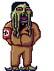
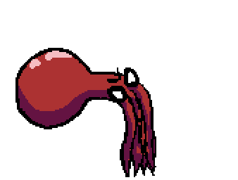
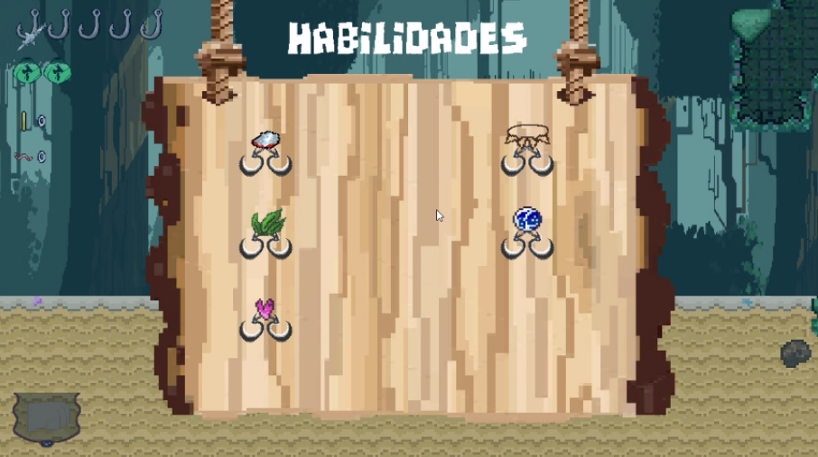

# CaptainBrineTooth
This repository is made for the development of the videoGame Captain BrineTooth.

**Documento de diseño de videojuego**

_David Brey Plaza, Adrià Carreras Bagur, Miguel Hernández García, Ángel López Benítez, Óscar Maya Jiménez, Juan Diego Mendoza Reyes, Iván Prado Echegaray, José Daniel Rave Robayo, Daniel Ruiz Figueroa_

| **Resumen** |
| --- |
| **Géneros:** RogueLike, Acción |
| **Modos:** Aventura |
| **Público objetivo:** _Todo el mundo_ |
| **Plataformas:** PC |
| **Cantidades:** Escenarios = 3 Armas = 9 Personajes = 2 (Pescador y Fishtler) Enemigos = 5 Boss = 1 |
| **Hitos:** 24 Febrero [HITO 0] - 17 Marzo [HITO 1] - 28 Abril [HITO 2] - 26 Mayo [ENTREGA] |

**Descripción**

Captain BrineTooth es un videojuego surgido como proyecto para la asignatura Proyectos 2 en la Universidad Complutense de Madrid. Los desarrolladores iniciales son estudiantes aún novatos en la realización de videojuegos con C + +.

La gestión de este proyecto se realizará en Pivotal Tracker: (https://www.pivotaltracker.com/n/projects/2489365)

El control de versiones se realizará utilizando GitHub: (https://github.com/JosedaMachine/CaptainBrineTooth)

Captain BrineTooth no tiene antecedentes o predecesores.

El juego será producido utilizando Visual Studio y la librería SDL.

| **Logotipo y portada del juego** |
| --- |
|  |

**Documento**

1. **Aspectos generales**

Captain BrineTooth es un juego roguelike en el que se pretende transmitir al jugador una sensación de frenetismo y rapidez.

Nuestro jugador controlará a un pescador gallego, quien ha naufragado en una isla aparentemente desierta, pero luego descubre que no está solo. Debido a varios residuos tóxicos de la 2º guerra mundial, varios peces han mutado volviéndose agresivos. Entonces, buscando una forma de salir de ahí, busca al enemigo más fuerte para derrotarlo y escapar

La principal mecánica innovadora del juego es la mecánica de pesca, en la que el jugador utiliza su caña para intentar obtener un arma o mejora en un minijuego. El arma o mejora obtenida depende de la suerte del jugador y de su habilidad. Esto añade una cierta aleatoriedad a la partida que provoca que cada partida sea diferente.

Independientemente del arma que consiga, el jugador tendrá que intentar avanzar por el nivel derrotando enemigos de la forma más eficiente posible.

  1.1. **Relato breve y parcial de una partida típica**

El jugador comienza en una zona inicial donde podrá obtener su primera arma mediante un minijuego de pesca explicado más adelante. A partir de ahí se dará paso a un dungeon con habitaciones generadas de manera aleatoria. La mayoría de estas habitaciones son salas con enemigos que el jugador debe de derrotar. El jugador también se podrá encontrar con una sala especial en la que se encontrará de nuevo el minijuego de pesca inicial, pero esta vez conteniendo tanto armas como mejoras. Dependiendo de su habilidad y suerte el jugador deberá de intentar conseguir el objeto que más le convenga de este minijuego.

En una de las salas el jugador se encontrará con un jefe final que deberá de derrotar para pasar al siguiente piso del dungeon. Cada vez que el jugador pasa de piso se encontrará de nuevo con el minijuego de pesca pero mantendrá sus objetos y mejoras del piso anterior.

2. **Menús y modos de juego**

Menu de Pausa

Menú de Opciones

  2.1. **Configuración**

Menú de opciones: Podrás subir o bajar el volumen del juego, ver los créditos del juego y los contactos de los desarrolladores del juego.

Glosario el Monstruoso DIARIO de Monstruos Marinos: Se podrá ver un glosario el cual explica el origen de todos los enemigos, las armas y sus características, las mejoras y sus efectos, el árbol de habilidades con cada habilidad explicada

  2.2. **Interfaz y control**

3. **Jugabilidad**
  3.1. **Mecánica**

TUTORIAL
Enseñamos al jugador a manejar las mecánicas principales del juego en un pequeño tutorial

MECÁNICA DE PESCAR

El jugador puede pescar 1 vez por cada pozo que encuentre, siempre y cuando tenga un cebo. Cada vez que lo intenta, inicia un minijuego (Cambiamos de pantalla) en el que el jugador maneja el gancho de la caña intentando pescar la mejor arma posible.

La caña irá bajando automáticamente y el jugador podrá moverse lateralmente, esquivando obstáculos. Habrá 3 capas de profundidad y cuanto más profundo llegue el jugador, mayor la calidad del recursos que consiga.

Cuando el jug

Ej Gráfico:

MOVIMIENTO

El jugador puede moverse lateralmente. Para moverse con más facilidad, podrá hacer un dash (que se ve como un slide). Además podrá equiparse con armas y atacar con ellas.

SISTEMA DE COMBATE

El jugador podrá tener a su disposición 2 armas como máximo, empezando con sus puños. El jugador podrá alternar entre ambas armas, pero nunca usar las 2 a la vez.

ECONOMÍA Y CEBOS

El jugador puede conseguir monedas derrotando enemigos. Cada enemigo suelta una cantidad que varía dependiendo del tipo de enemigo y el nivel en el que esté el jugador
Por cada nivel, recibe un bonus de 25%

Además, los enemigos podrán dropear con una posibilidad de 16-20%, un cebo el cual es necesario para poder pescar.

  3.2. **Dinámica**

El videojuego se presenta en una vista lateral con el jugador al mando del Capitán Brinetooth. En su aventura encontrará una gran variedad de armas que le ayudarán a derrotar las hordas de Fishler.

Comenzará con un arma base que serán sus propios puños y a lo largo de la partida podrá llevar hasta 2, pudiendo cambiar entre ambas. El jugador tendrá que abrirse camino a través de varias habitaciones. Al avanzar de sala la siguiente que se escoge, será de manera aleatoria, haciendo que cada intento sea único. El Capitán debe superar tres zonas temáticas en función de la profundidad relativa a la que se encuentra el jugador.

Para completar una partida, el jugador deberá derrotar a Fishler. Si el Capitán es derrotado y muere, vuelve al lobby y donde podrá desbloquear nuevas habilidades así como comenzar un nuevo intento de derrotar a Fishler.

  3.3. **Estética**

Estética de Pixel Art.Siguiendo un estilo pixel art.

4. **Contenido**

Ahora pasamos a describir todo el contenido jugable del juego:

  4.1. **Historia**

Pescador gallego en la segunda guerra mundial. Naufragas en una isla la cual está contaminada por antiguos residuos tóxicos alemanes de la 2º guerra mundial. Los peces se empiezan a convertir en peces nazis y para salir de la isla tienes que llegar hasta Fishtler que es muy malo dependiendo de tu punto de vista respecto a la sociedad y la política y para nuestro pescador eso está mal.

  4.2. **Lobby**

En el lobby se podrá desbloquear ciertas habilidades del árbol de anzuelos.

  4.3. **Niveles**

El mapa estará conformado por varios bloques separados, y se encarga de generar un mapa randomizado, uniendo dichos bloques. La generación de estos se formará tal que será linear hasta cierto punto, donde se dividirá en ramas.

Ej Gráfico:

Habrá 3 niveles diferentes, tal que tendrán como principales diferencias:

- La estética de los escenarios
- Tipos de sala que se generan.
- Nº de habitaciones

Sala de Pesca:

El número de habitaciones de cada nivel se repartirán tal que:
- 1º nivel = 7 habitaciones
- 2º nivel = 7 habitaciones
- 3º nivel = 7 habitaciones

Las habitaciones se generan todas al inicio del nivel y se destruyen al pasar de nivel. Estos se generarán como mapa de TILED.

  4.4. **Música y banda sonora**

- Drunken Sailor = Menú principal
- Adventure = Nivel 3
- Celtic = Nivel 1
- Travel Cinematic = Nivel 2
- Final Boss = Old Man’s Tale
- Sala de pescar = The happiness 
- Minijuego de pesca = The sailor song
- Lobby = The sailor waltz
- Créditos = Wellerman

  4.5. **Personajes**
  En este apartado describimos los personajes que van apareciendo en el juego:
    4.5.1. **Protagonista (Pescador)**

Pescador: Pescador gallego que naufraga en una isla llena de peces nazis

**IMAGEN**

**Vidas**

El jugador tendrá unos 5 anzuelos / vidas de forma inicial, cada ataque que reciba le quitará medio anzuelo.

    1. **Enemigos**

**Fanfin Anglers → ThornFish**

- Pez enterrado en el suelo, que lanza descargas eléctricas cada cierto tiempo.
- Vida = 150

**IMAGEN**

**Mitsukurina owstoni → ElfShark**

- Lo más característico de este ser es su capacidad deproyectar su mandíbula hacia delante cuando abre la boca. **(ATAQUE DE ÁREA).**
- Vida = 225

**IMAGEN**

**GusanoPompeya → PompeyWorm**

- Ataca lanzando un proyectil que al entrar en contacto con algo explota y envenena el suelo, igual que el suelo que pisa.
- Vida = 175

**IMAGEN**

**Medusa del Sombrero de flores → FlowerJellyHat**

- Estas medusas comen peces pequeños y pueden crecer o reducir su tamaño en función de la proximidad del enemigo.
- Ataque de la medusa: Uso de su cuerpo.
- Vida = 150

**IMAGEN**

**Fringehead**

- Ataca disparando proyectiles que son plankton.
- Vida = 125

**IMAGEN**

**FISHLER**
- Fishler tendrá 2 fases. Al perder la mitad de su vida.

- Movimiento
  - **[1º FASE]** Camina X pasos de forma normal hacia el jugador
  - Placaje (Corre directamente hacia el jugador a modo de placaje)
- Ataque sorpresa (El ataque es parecido al de ElfShark)
  - Dispara de lejos com el FringeHead 
  - **[2º FASE]** Lanza puas con cierto ángulo
  - Visualmente, se verá como Fishler usa unas espinas que dispara erizos de mar

- VIDA = 5000
- **CONCEPT ART DE FISHLER**

- **SPRITE OFICIAL**

  4.6. **Items**

**CANTIMPLORA**

Item que restaura 3 anzuelos de vida. El jugador empezará con 2 usos como máximo de su cantimplora, la cual cada uso le recupera 3 de vida. El límite de usos se pueden aplicar con cierta habilidad del árbol de anzuelos.

- TODOS LOS DAÑOS DE LAS ARMAS TIENEN YA APLICADO EL X2 DEL DAÑO

**Armas CUERPO A CUERPO**

| Pez Espada | Ataca con dos amplios tajos de espada y finaliza con una serie rápida de estocadas |  | DAÑO = 30 primer golpe, 30 segundo golpe, 40 todas estocadas |
| --- | --- | --- | --- |
| Tiburón Martillo | Ataca con un swing lateral, mandando hacia atrás al enemigo ( **KnockBack** ) |  | DAÑO = 65 primer golpe, 70 segundo golpe |
| Pez Sierra | Estilo de combate: 2 swings y una estocada con la sierra que se puede mantener unos instantes. Matar a un enemigo supone un buff de ataque y velocidad. Se puede acumular buffs hasta un límite. Después de X tiempo, se devuelve los stats del jugador a la normalidad |  | DAÑO: 80 primer golpe, 80 segundo golpe, 90 último golpe |
| Puños Crustáceos | Atacas dando puñetazos |  | DAÑO 80 primer golpe, 60 segundo golpe, 110 tercer golpe |
| Puos normales | Atacas dando puñetazos (Arma base) |  | Daño 20 primer golpe, 20 * 2 golpes, 40 tercer golpe |

**Armas a DISTANCIA**

| Ametralladora de anchoas | Dispara balas con mucha cadencia. El arma se sobrecalienta y no puedes disparar durante un tiempo | Pez que escupe anchoas | DAÑO 7 de daño por bala |
| --- | --- | --- | --- | --- |
| Escupe-Tintas | Ataca con una nube oscura de tinta que envenena y ralentiza (La nube dura 2 segundos aprox) |  | DAÑO 20 por disparo. 7 por veneno * 1 segundo |

  4.7. **Árbol de Anzuelos**

Habrá un árbol de habilidades las cuales se podrán desbloquear de 2 formas:

- Realizando cierta acción (Matar a cierto enemigo, realizar X cantidad de bajas con Y arma...)
- Pagando cierta cantidad (Solo se pueden comprar únicamente en el lobby [Lo cual significa que el dinero no se pierde al morir])

Habrá 4 ramas principales

- Rama de utilidad
- Rama defensiva
- Rama ofensiva

Algunas de las habilidades son:

- Collar de piraña: x2 de daño a las armas
- Piedra de salmuera (Aumenta la rapidez con la que ataca)
- Kit de anzuelos: el jugador consigue 2 anzuelos extras de vida (Equivalente a 4 golpes)
- Extracto de algas: aumenta el número de usos de la cantimplora y se podrá usar un total de 3 veces.
- Escamas de Arapaima: si el jugador recibe daño, el enemigo recibe 100 de daño.

5. **Progresión del juego**
  5.1. **Estimación dificultad del juego**
- 1º PARTIDA (0 conocimiento de enemigos, 0 dinero, 0 manejo controles, llega al principio de la capa amarilla de pesca)
  - 1º Nivel (1-3 enemigos x nivel )

    - Medusa = 1-2 golpes
    - ElfShark = 2-4 golpes
    - +1-2 Golpes x habitacion con trampas
    - TOTAL = 3.5 golpes x enemigo x habitacion
  - 2º Nivel
    - Lo más probable es que no llegue, o se quede a principios de nivel
  - 3º Nivel
    - Díficil de llegar.
- Varias Partidas (Conocimiento de enemigos de 1º nivel y parcial del segundo nivel, Ahorros suficientes como para comprar de vez en cuando un arma, puede pescar hasta la capa amarilla rozando la roja, manejo basico de controles, sabe usar bien las armas básicas del juego, sabe usar la cantimplora pero no usarlo en el momento correcto, sabe que existen mejoras y un arbol de habilidades pero no lo entiende muy bien)
  - 1º Nivel (1-3 enemigos x nivel)
    - Medusa = 0-1 golpes x habitacion
    - ElfShark = (1-3 golpes) → 2 golpes x habitacion
    - TOTAL = 1-2 golpes x enemigo x habitacion

  - 2º Nivel (1-4 enemigos)
    - Medusa = 1-2 golpes x habitacion (Nunca como unico enemigo)
    - ElfShark = 4 golpes x habitacion

    - ThornFish = 3 golpes x habitacion (Nunca como unico enemigo)
    - FringeHead = 4 golpes x habitacion
    - TOTAL = 2.333333 golpes x enemigo x habitacion

  - 3º Nivel (2-5 enemigos)
    - Medusa = 0-1 golpes x habitacion (Ratio de aparicion + bajo que los 2 niveles anteriores)(Nunca como unico enemigo)
    - ElfShark = 3-4 golpes x habitacion (Ratio de aparicion + bajo que los 2 niveles anteriores) (Nunca como unico enemigo)

    - ThornFish = 3 golpes x habitacion (Nunca como unico enemigo)
    - FringeHead = 5-6 golpes x habitacion

    - Pompey Worm = 7 golpes x habitacion
    - TOTAL = 4.25 golpes x enemigo x habitacion

- Veterano (Conoce bien los enemigos del 1º y 2º nivel, puede permitirse conseguirse armas mas seguido, alcanza con relativa facilidad la capa roja al pescar, manejo bastante amplio de controles, sabe distinguir que arma es mejor, ahorra usos de la cantimplora, entiende bien las mejoras y sus efectos, desbloqueadas algunas habilidades del arbol y sacadole parcialmente su potencial)
  - 1º Nivel (1-3 enemigos x nivel)
    - Medusa = 0 golpes x habitacion
    - ElfShark = 0-1 golpes x habitacion
    - TOTAL = 0.3333 golpes x enemigo x habitacion

  - 2º Nivel
    - Medusa = 0-1 golpes x habitacion (Nunca como unico enemigo)
    - ElfShark = 1-2 golpes x habitacion

    - ThornFish = 1-2 golpes x habitacion (Nunca como unico enemigo)
    - FringeHead = 2-3 golpes x habitacion
    - TOTAL = 0.8-1.8 golpes x enemigo x habitacion

  - 3º Nivel
    - Medusa = 0 golpes x habitacion (Ratio de aparicion + bajo que los 2 niveles anteriores)(Nunca como unico enemigo)
    - ElfShark = 2 golpes x habitacion (Ratio de aparicion + bajo que los 2 niveles anteriores)(Nunca como unico enemigo)

    - ThornFish = 2 golpes x habitacion(Nunca como unico enemigo)
    - FringeHead = 4 golpes x habitacion

    - Pompey Worm = 4-5 golpes x habitacion
    - TOTAL = 2.25-2.625 golpes x enemigo x habitacion

- GAME MASTER (Conoce todos los enemigos y sus patrones, pocas veces empieza con el arma por defecto, alcanza frecuentemente el premio final de la zona de pesca, uso perfecto de la cantimplora, entiende y explota al maximo las mejoras y arbol de habilidades creando sinergias rotisimas)
  - 1º Nivel (1-3 enemigos x nivel)
    - Medusa = 0 golpes x habitacion
    - ElfShark = 0-1 golpes x habitacion
    - TOTAL = 0.3333 golpes x enemigo x habitacion

  - 2º Nivel
    - Medusa = 0 golpes x habitacion
    - ElfShark = 0 golpes x habitacion

    - ThornFish = 1 golpes x habitacion
    - FringeHead = 1-2 golpes x habitacion
    - TOTAL = 0.6 golpes x enemigo x habitacion

  - 3º Nivel
    - Medusa = 0 golpes x habitacion (Ratio de aparicion + bajo que los 2 niveles anteriores)
    - ElfShark = 1-2 golpes x habitacion (Ratio de aparicion + bajo que los 2 niveles anteriores)

    - ThornFish = 1-2 golpes x habitacion
    - FringeHead = 2 golpes x habitacion

    - Pompey Worm = 4 golpes x habitacion
    - TOTAL = 1.375-1.75 golpes x enemigo x habitacion

**Referencias**

- _Dead Cells_
- _Hollow Knight_
- _Enter The Gungeon_
- _Binding of Isaac_
- _Metroidvania_
- _Cave Story_
- _Movilidad del Celeste_
- _Flashback diseño del nivel_
- _Rogue Legacy_
- _Diseño de nivel brutal Yoshi Island_
